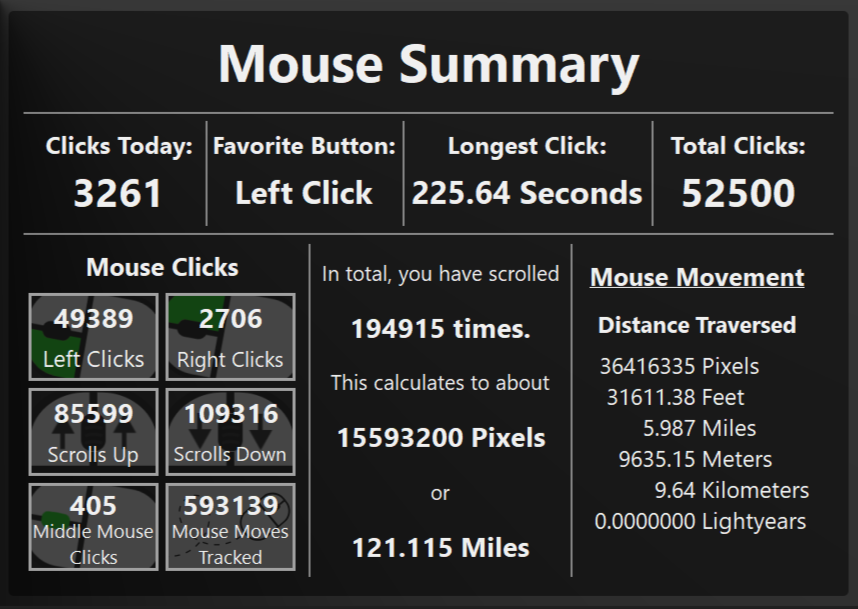
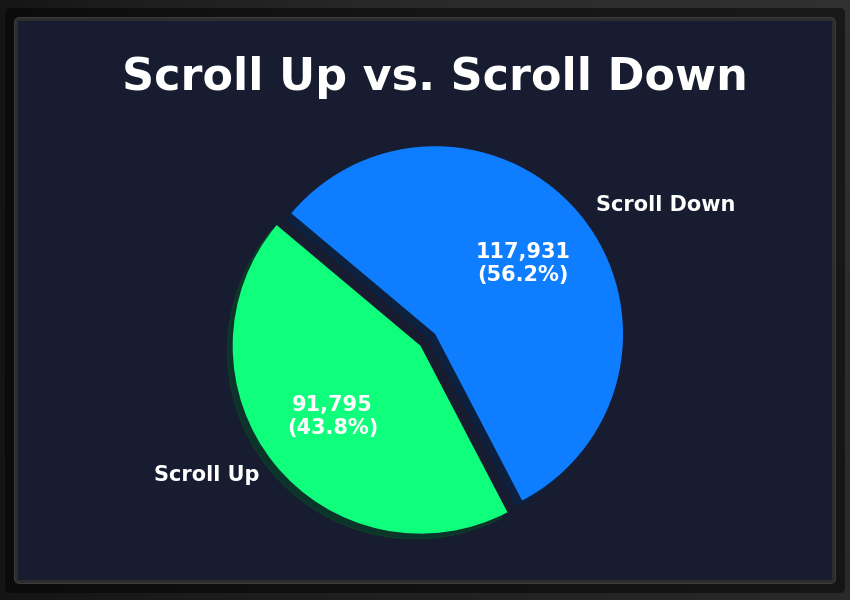
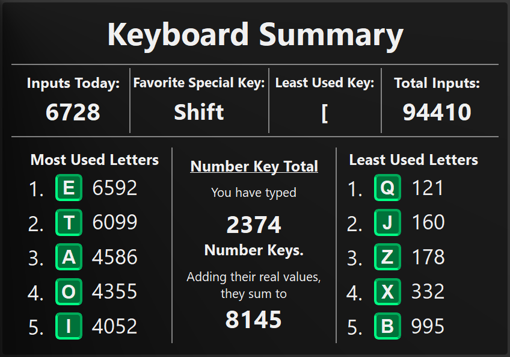
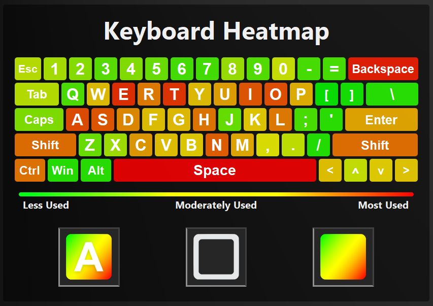
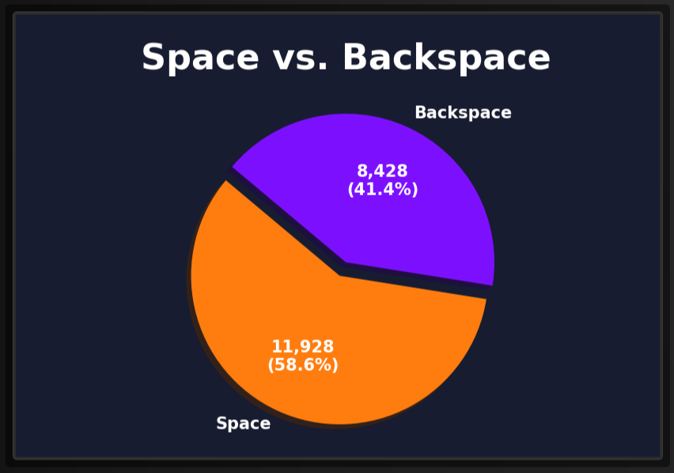
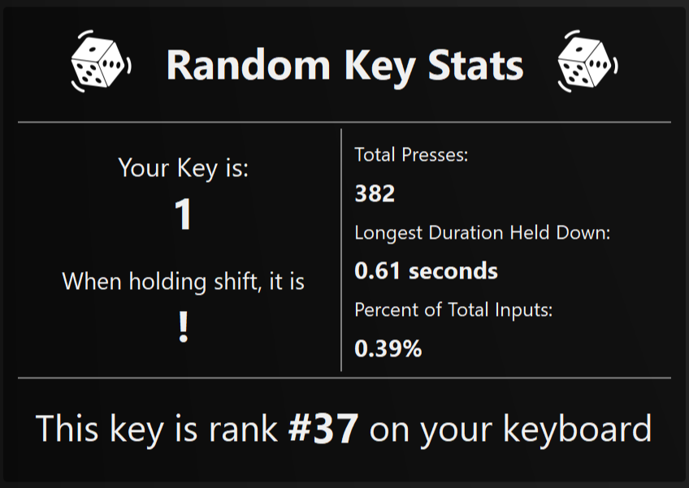
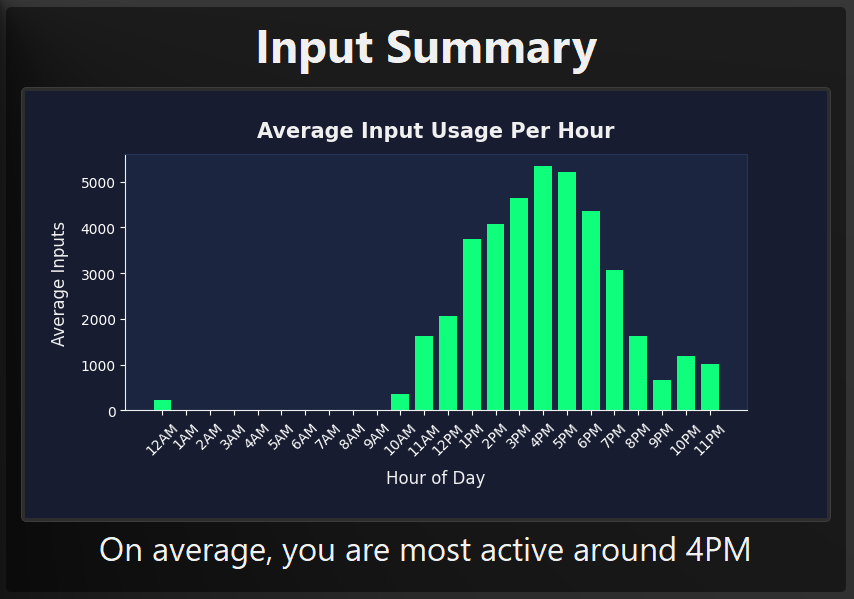
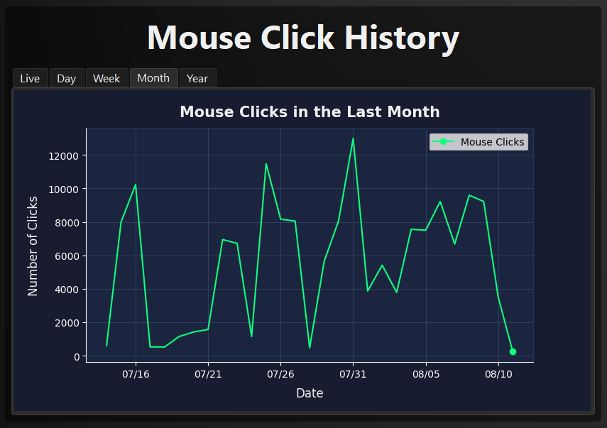
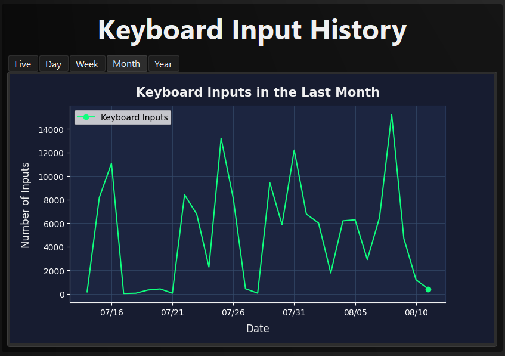
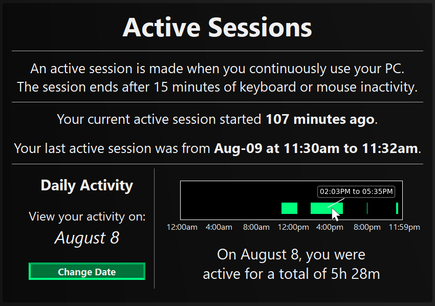

  

#### Quick Links
- [Overview](#overview)
- [Features](#features)
- [Download](#download)
- [Help](#help)

## Overview
MyPCStats lets you track your lifetime computer inputs with new ways to view your keyboard and mouse input data.

## Features
MyPCStats is launching with a variety of different ways to view your computer activity. From mouse and keyboard input statistics to data analytics, you can view all of your input activity in one place.

#### Mouse
View your overall mouse input statistics on the Mouse Summary page. This holds convenient information, such as click totals, mouse movement totals, and more.

  

---

The Scroll Up vs. Scroll Down pie chart shows a simple representation of how often you scroll up compared to scrolling down.

  

---

Fill up your screen with color by using the 24 hour click map, an overlay that shows you your last 24 hours of click history with colored dots. There are 5 different toggle buttons to change the way the data is displayed:

- **High Contrast:** the button with the 2 circles with a lined cross section makes the overlay darker, allowing easier viewing of the dots.
- **Animation:** Toggles the animation of drawing each dot individually.
- **Green Dot:** The green dots signify left click inputs from the mouse, and the green dot button can be used to turn them off or on.
- **Red Dot:** The red dots signify the right click inputs from the mouse, and the red dot button is used to turn them on or off.
- **Yellow Dot:** The yellow dot is for middle click inputs and the button toggles them on or off.

Press the esc button to leave the overlay.

  

---

View your mouse movement history with the move map, an overlay that shows your previous 2,000 (or 10,000) mouse movements. This overlay has 4 different toggle options:

- **High Contrast:** the button with the 2 circles with a lined cross section makes the overlay darker, allowing easier viewing of the dots.
- **Animation:** Toggles the animation of drawing the lines.
- **Line Thickness:** Changes the line thickness of the lines drawn from thick to thin.
- **Movement History Amount:** Changes the amount of recent mouse movements shown between 2,000 and 10,000.

Press the esc button to leave the overlay.

  

#### Keyboard
See your summary of keyboard inputs on the Keyboard Summary page. This page has convenient keyboard input information, such as keyboard input totals, most used letters, and other insightful features.

  

---

The Keyboard Heatmap is a depiction of your keyboard interaction history, showing the most used keys as red hot points and least used keys as green points. This overlay has 3 toggleable buttons:

- **View Letters Button:** Allows you to toggle the appearence of the letters and key names on the keyboard for better visibility.
- **Rounded Corners:** Toggles rounded or sharp corners on each key.
- **Color Scheme:** Changes the colors of the heatmap from the traditional green-to-red to a dark-to-light green scheme akin to the colors of the app.

  

---

View the feud between space and backspace on the Space vs. Backspace pie chart.

  

---

View various statistics of random keys with the Random Key Stats page. By clicking on either of the die, a random key on the keyboard is selected, and various details about it are shown.

  

#### Analytics

The Input Summary Page presents a graph of average inputs throughout the day, telling you your most active computer usage hours.

  

---

The Mouse Click History plot has 5 settings to display your history of mouse inputs:

- **Live:** Last hour.
- **Day:** Last 24 hours.
- **Week:** Last 7 days.
- **Month:** Last 30 days.
- **Year:** last 12 months.

Depicted below is an example of the "Month" plot.

  

---

Just like the Mouse Click History plot, the Keyboard Input History Plot has 5 settings to display your history of keyboard inputs:

- **Live:** Last hour.
- **Day:** Last 24 hours.
- **Week:** Last 7 days.
- **Month:** Last 30 days.
- **Year:** last 12 months.

Depicted below is an example of the "Month" plot.

  

---

The active sessions page is an experimental way to see your typicsl computer actity. It uses your past keyboard and mouse inputs to infer the times you were active on your computer. On the Active Sessions page, there are various points of interest:

- **Current Session:** Tells you when your current active session started.
- **Last Active Session:** Displays your last active session on your computer.
- **Daily Activity Calendar:** Allows you to change the date and to view your activity on that day.
- **Daily Activity Plot:** Shows a 24 hour graph of periods when you were active on your computer. Hovering over the data allows for deeper analysis of usage times.

  

## Download
[Download the latest version of MyPCStats](https://github.com/LukeBarcenas/MyPCStats/releases/latest) - Get the latest version here.

#### Step 1
Head to the latest release page (linked above) and download the latest release by clicking on the "MyPCStats.zip" link in the assets section of the page.

#### Step 2
Open the zip file and move the MyPCStats folder to an accessible location (Desktop is easiest).

#### Step 3
In the MyPCStats folder, open the "scripts" folder and double click "PCStatsCollector" and, if prompted, go through the security process of opening the script.

#### Step 4
With the script running, your inputs are being added, and you can view your data by opening the "MyPCStats" app!

#### Step 5 (For always having inputs collected)
On your keyboard, press "Win+r" to open the command window, and type "shell:startup" to go to your startup folder

Head back to the "scripts" folder in the "MyPCStats" folder and make a shortcut of "PCStatsCollector" by right clicking the file, pressing "Show more options", then "Create shortcut".

Drag this newly created shortcut into the "startup" folder and you are good to go! Your stats should now always be collected on startup.

## Help
#### Data not being collected?
In the MyPCStats app, go to the homepage in the questions section or the settings and click the link to open the application's folder. Head to the scripts folder and double click "PCStatsCollector". Then, stats should start being collected. If you want to have it automatically start, follow step 5 in the download section.

##### Still not working or found a new bug? Report it to the Issues page, and I'll get to it as soon as possible.

